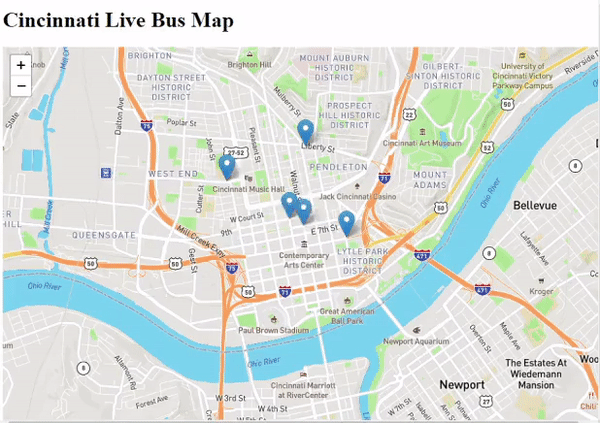

#Highlights
Simulating a real-time bus map of the city of Cincinnati as I am learning my way around Kafka.

Built using Kafka for stream processing, Javascript, Leafletjs for interactive maps, and Flask for the web app.

